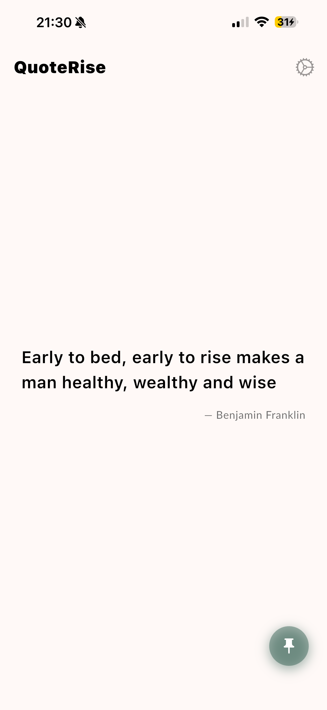
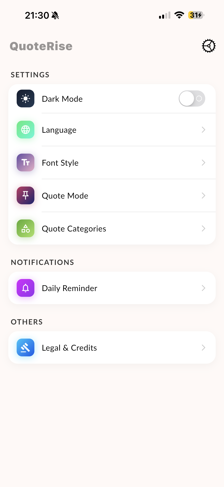
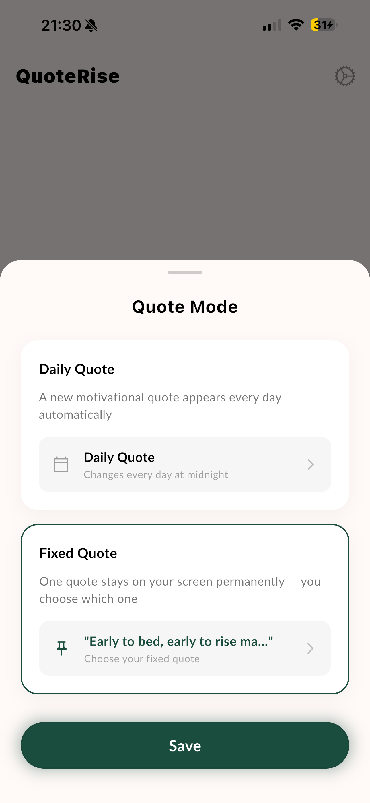
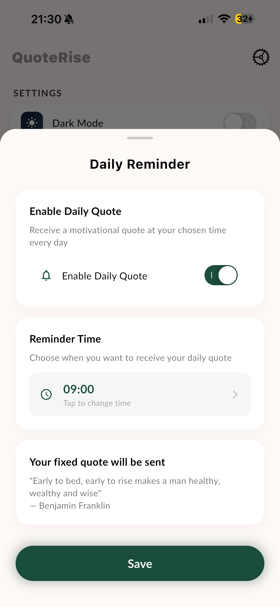

# QuoteRise — Daily Motivational Quotes

A minimal Flutter app that delivers a fresh motivational quote every day, with home screen widget support and daily push notifications. Built in ~2–3 hours as a quick side project.

[](https://apps.apple.com/app/id6775193109)

---

## Screenshots

<p float="left">
  
  
  
  
</p>

---

## Features

- Daily motivational quote with one-tap refresh
- Home screen widget
- Daily push notifications
- 11 languages (EN, DE, ES, FR, IT, PT, RU, HI, ZH, JA, AR)
- Dark / Light mode
- Custom font selection

## Tech Stack

- **Flutter** (Dart)
- `provider` — state management
- `easy_localization` — multi-language support
- `flutter_local_notifications` — daily reminders
- `shared_preferences` — local persistence
- iOS Widget extension

## Getting Started

```bash
flutter pub get
flutter run
```

---

*Available on the App Store — [QuoteRise](https://apps.apple.com/app/id6775193109)*
